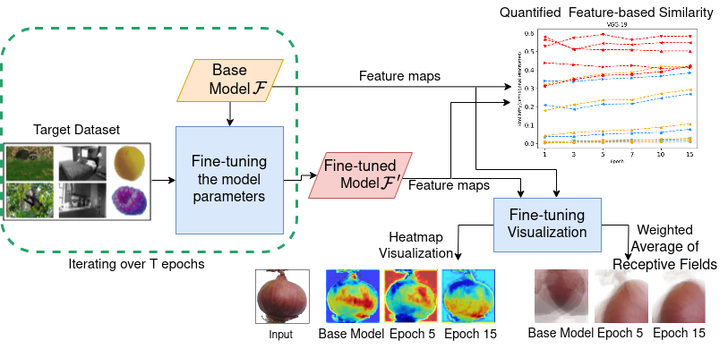

# An Empirical Study of Feature Dynamics During Fine-tuning

This repository contains the implemenetation code for the following paper.

An Empirical Study of Feature Dynamics During Fine-tuning

# Abstract

Fine-tuning is the common practice of adapting a pre-trained model so that the encoded features can be reused for a new target task.
Up to now, there have been efforts in the literature to get insights from the fine-tuning process by measuring the internal feature alignment between the source and the target datasets. However, they suffer from three weaknesses. 
First, their findings are limited to a few datasets, deep models and focused on only one similarity metric which results in discordant observations and doubts regarding reliability. 
Second, the conducted evaluations are either purely qualitative, which lends itself to subjectivity; or purely   quantitative, which suffers from reduced intelligibility.
Third, existing analysis focus on the two extremes of the fine-tuning process, i.e. on the model pre and post fine-tuning. In doing so, there is no room for analyzing the dynamics that link these two extremes. 
Here, we conduct both quantitative and qualitative analyses that aim at shining a light on the feature dynamics during iterative stages of the fine-tuning process. 
The analysis shows that feature similarity is reduced, even in early stages, between the source model and its fine-tuned counterparts when the target domain is dissimilar. Moreover, it illustrates domain shift across iterations of fine-tuning procedure. 
We believe the presented methodology could be adopted for the analysis of fine-tuning processes and help pinpoint the reasons why some of these processes are more effective than others.

# Reference

If you find our code useful for your research, please cite our paper.

@inproceedings{behzadi2024transferinterpretation,
  title={An Empirical Study of Feature Dynamics During Fine-tuning},
  author={Behzadi-Khormouji, Hamed and De Roeck,Lena  and Oramas, Jos{\'e}},
  booktitle={ECML PKDD International Workshop on eXplainable Knowledge Discovery in Data Mining },
  pages={},
  year={2024}
}

